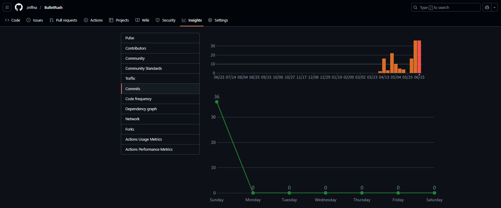

# BulletRush
### 게임 컨셉
가장 가까운적을 자동으로 공격하는 생존 게임. 
- 플레이어 조작 : 이동
- 성장 : 적을 처치할 경우 확률에 따른 파워업 아이템 드랍
- 무기 : 각각의 무기는 사정거리가 존재, 사정거리 이내의 가장 가까운 적을 향해 사격. 시간에 따른 자동 사격

### 개발 범위  
- 게임 루프 : MainGame class
- 입력 및 시간 처리 : Touch 이벤트, Choreographer
- 애니메이션 : Sprite
- 맵 구현 : Background Layering (Parallex Scroll)
- 적 생성 : EnemyGenerator
- 게임 오브젝트
    - 플레이어
        - Touch 이벤트를 통한한 이동                
    - 총 : AR, SG, SR
        - 공격속도에 따라 자동 사격   
        - 생성되는 총알의 충돌횟수 및 이동거리, 데미지를 정의
    - 총알 
        - 충돌 시 피해를 입히며, 생성시 충돌 검사대상의 Layer, damage, 방향등을 총으로부터 받음.
    - 적
        - 모든 적은 플레이어를 추적. 공격 범위에 들어온 플레이어를 공격.
        - 종류 : 3 종 (기본, 돌진, 사격)
        - 기본형 : 플레이어를 향해 이동하며, 충돌시 피해를 입힘.
        - 돌진형 : 플레이어를 향해 빠르게 돌진하되, 돌진시작시 방향을 계속 유지한다. 
        일정 시간 또는 화면밖으로 이동시 일정시간 정지하며, 다시 플레이어 방향으로 돌진한다.
        - 사격형 : 총을 소유. 사격 범위에 들어온 플레이어를 사격하며, 사격범위 내에 플레이어가 존재할 경우, 추가적인 이동을 하지 않는다. 
    - 파워업 종류 : 4종류 (체력 증가, 공격력 증가, 공격속도 증가, 이동속도 증가)
        
- UI
    - 적의 체력바 출력

- 스테이지 구성  
    - 적은 10초 간격으로 생성
    - 적이 스테이지에 존재하지 않을 시 즉시 생성
- 충돌 및 피해 처리  
    - 적과의 충돌 : 0.5초당 1회만 피격
    - 총알과의 충돌 : 전부 피격
  
### 예상 게임 실행 흐름  

### 개발 일정  
- 1주차
    - 프레임 갱신 루프 이해 및 구현
    - 이동 속도, 시간 기반 이동 적용
    - 게임 기본 출력요소 구현
        - 디버그용 grid, FPS 출력
- 2주차
    - ~~게임 오브젝트 클래스 작성~~
    - SampleGame의 모듈을 사용 설정
- 3주차
    - 플레이어, 적 오브젝트 작성  
- 4주차
    - 총, 총알 오브젝트 작성
    - 적 오브젝트 및 EnemyGenerator 작성  
- 5주차 
    - 이동에 따른 Background Layering 작성  
    - 파워업 오브젝트 작성
- 6주차 
    - 충돌처리
- 7주차 
    - UI 및 시간, Wave 정보 출력 구현  
- 8주차
    - 코드 최적화 및 버그 수정  

### 진행 상황
|개발 항목 | 진행 정도 |
|:-------|:-------|
|게임 루프 |100%|
|입력 및 시간 처리|100%|
|애니메이션 |100%|
|오브젝트 작성 |100%|
|적 생성 |100%|
|맵 구현 |100%|
|게임 진행|50%|
|충돌 및 피해처리 | 100% |
|UI|50%|

### 주차별 commit 횟수

| 주차 | 횟수 |
|:-------|:-------|
|1주차 |9|
|2주차 |8|
|3주차 |11|
|4주차 |14|
|5주차 |13|
|6주차 |3|
|7주차 |1|
|8주차 |1|
|9주차 |26|
|10주차 |61|

### 개발시 사용한 방법들
- 사용된 기술
    - Background Layering
    - 충돌처리
    - Object Recycle
    - Bitmap Text Render
    - World Wrapping
- 수업내용에서 차용한 것
    - Score
    - Animation Sprite
    - Scene
    - Sound
    - Gauge
    - EnemyGenerator
    - Collision Check
    - Multiple Scene / Transparent Scene
- 직접 개발한 것
    - World Wrapping
    - Enemy Type별 로직
    - Damage Popup

### 아쉬웠던 요소
- 게임진행
    - 계속해서 생존하는 게임인데, 진행되는 과정중에 보스전같은 이벤트를 만들지 않은것.
- 게임결과 Scene
    - Player가 죽으면 Title로 돌아가서 미완성된 느낌을 받음.
- LevelUp과 강화 되는 표현의 부족
    - 레벨업시 강화 창이 뜬다던가,LevelUp이 되었을때 보이는 요소가 부족한것.
- 선택 요소의 부족
    - 처음의 무기 선택을 제외하면 적을 처치할때 나오는 PowerUp 아이템만으로 강화되어서 빨리 지루해지는 점.

### 수업을 통해 배운 점
- 이번 수업에서 기대한 것, 얻은 것, 얻지 못한 것
    - 기대한 것 : Android의 구성과 개발을 위해 필요한 정보 및 기술
    - 얻은 것 : 기대한 것과 더불어 게임 개발에서 객체지향을 최대한 활용하는 방법
- 더 좋은 수업이 되기 위해 변화할 점
    - 딱히 없다고 생각된다.

### gameObject 설명
#### Player
- class 구성 정보
    - Sprite : Idle, Move
    - 동작 : joystick에의해 속도 결정. 이동시 Move, 정지시 Idle 출력
- 상호작용 정보
    - Enemy 와 충돌시 피격
- 핵심 코드
    - player가 화면의 중심이어야 하기에 camera 정보를 갱신시킨다.
    - player는 joystick의 정보를 받아 이동을 수행한다.   
#### Enemy
- class 구성 정보
    - Sprite : Idle, Move
    - 동작 : 공격사거리에 플레이어 존재시 -> 플레이어 공격, 아닐경우 플레이어를 향해 이동
- 상호작용 정보
    - Player를 추적 및 공격
- 핵심 코드
    - 플레이어의 위치를 이용하여 이동방향 제어 행동 결정
#### Gun
- class 구성 정보
    - Sprite : 총리소스
    - 동작 : 가까운 표적을 향해 회전
- 상호작용 정보
    - 공격속도에 따라 총알을 생성
- 핵심 코드
    - 자동 타겟팅 및 공격속도에 따른 총알 생성
#### Bullet
- class 구성 정보
    - Sprite : 총알 리소스
    - 동작 : 속도에 따른 이동.
- 상호작용 정보
    - 충돌가능한 객체와 충돌 검사
- 핵심 코드
    - Gun에서 넘긴 속도와 방향을 그대로 이동하되, 주어진 거리를 가면 제거된다.
#### EnemyGenerator
- class 구성 정보
    - 동작 : 일정 시간에 따른 적의 생성
- 상호작용 정보
    - 시간에의해 적을 생성시킨다.
- 핵심 코드
    - generate() : 적을 생성한다.
#### ScrollBackground
- class 구성 정보
    - Sprite : 배경 이미지
- 핵심 코드
    - draw : 화면을 가득채우도록 draw를 반복한다.

